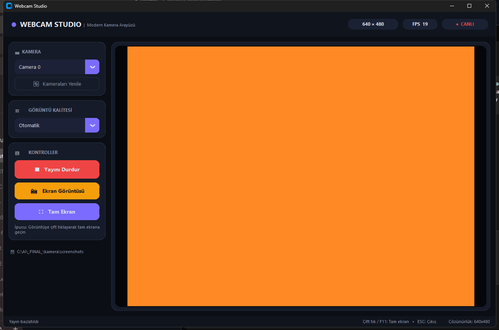
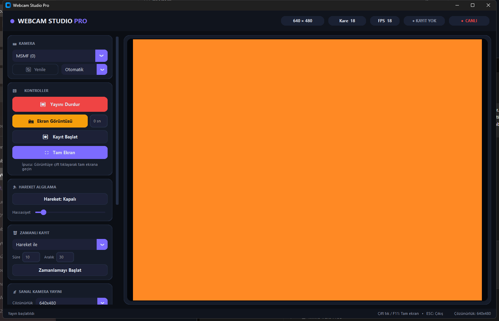

# Webcam Studio

Windows için modern, premium arayüzlü webcam uygulaması. İki farklı sürümle gelir: **Webcam App** (basit) ve **Webcam App Pro** (gelişmiş özellikli).

<br>

<p align="center">
  
  &nbsp;&nbsp;
  
</p>

---

## Sürüm Karşılaştırması

| Özellik | Webcam App | Webcam App Pro |
|---|:---:|:---:|
| Çoklu kamera desteği | ✅ | ✅ |
| Tek tıkla ekran görüntüsü | ✅ | ✅ |
| Çift tıkla tam ekran | ✅ | ✅ |
| Çözünürlük seçimi | ✅ | ✅ |
| FPS göstergesi | ✅ | ✅ |
| Koyu tema premium arayüz | ✅ | ✅ |
| Video kaydı (AVI) | ❌ | ✅ |
| Efektler (VHS, Retro, Sinema, Termal...) | ❌ | ✅ |
| PNG çerçeveler (key-color) | ❌ | ✅ |
| Hareket algılama | ❌ | ✅ |
| Zamanlı kayıt | ❌ | ✅ |
| Sanal kamera yayını (OBS) | ❌ | ✅ |
| Özelleştirilebilir çerçeve rengi | ❌ | ✅ |
| Zamanlayıcı ile ekran görüntüsü | ❌ | ✅ |

---

## Ekran Görüntüleri

### Webcam App
Uygulama başlatıldığında kameralar otomatik algılanır. Sol panelden kamera seçimi, çözünürlük ayarı ve kontroller yapılabilir.

<p align="center">
  
</p>

### Webcam App Pro
Gelişmiş özellikler: efektler, çerçeveler, hareket algılama, zamanlı kayıt ve sanal kamera desteği.

<p align="center">
  
</p>

---

## İndirme

### Standart Sürüm (Webcam App)
Her iki seçenek mevcuttur:

| Tür | Dosya | Açıklama |
|---|---|---|
| **Portable** | `WebcamApp-Portable.zip` | Kurulum gerektirmez, doğrudan çalıştırılır |
| **Kurulum** | `WebcamApp-Setup.exe` | Sihirbaz ile bilgisayara kurulum yapar |

### Pro Sürüm (Webcam App Pro)
| Tür | Dosya | Açıklama |
|---|---|---|
| **Portable** | `WebcamAppPro-Portable.zip` | Kurulum gerektirmez, doğrudan çalıştırılır |
| **Kurulum** | `WebcamAppPro-Setup.exe` | Sihirbaz ile bilgisayara kurulum yapar |

> Tüm sürümler Windows 10/11 için hazırlanmıştır. Python gerektirmez.

---

## Kaynaktan Derleme

### Ön Koşullar
- Python 3.8 veya üzeri
- pip

### Kurulum

```bash
# Depoyu klonlayın
git clone https://github.com/Cymeria/webcam-studio.git
cd webcam-studio

# Bağımlılıkları yükleyin
pip install -r requirements.txt
```

### Çalıştırma

```bash
# Basit versiyon
python webcam_app.py

# Pro versiyon
python webcam_studio_pro.py

# veya start.bat ile seçim yapın
start.bat
```

### EXE Oluşturma

```bash
# PyInstaller yükleyin
pip install pyinstaller

# Webcam App Portable
pyinstaller --name "WebcamApp" --windowed --onefile --noconsole webcam_app.py

# Webcam App Pro Portable
pyinstaller --name "WebcamAppPro" --windowed --onefile --noconsole webcam_studio_pro.py

# veya build.bat dosyasını çalıştırın
build.bat
```

---

## Dosya Yapısı

```
webcam-studio/
├── webcam_app.py                 # Basit versiyon (Webcam App)
├── webcam_studio_pro.py          # Pro versiyon (Webcam App Pro)
├── advanced_features.py          # Gelişmiş özellikler modülü
├── camera_filters.py             # Efekt ve çerçeve modülü
├── virtual_camera.py             # Sanal kamera modülü
├── requirements.txt              # Bağımlılıklar
├── start.bat                     # Hızlı başlatma scripti
├── build.bat                     # EXE derleme scripti
├── screenshots/                  # Ekran görüntüleri
│   ├── webcam_app_preview.png
│   └── webcam_app_pro_preview.png
├── filters/                      # PNG çerçeve dosyaları
│   ├── daire_cerceve.png
│   ├── kalp_cerceve.png
│   ├── modern_cerceve.png
│   ├── ornek_cerceve.png
│   ├── sulu_cerceve.png
│   ├── vip_cerceve.png
│   └── README.txt
├── take_screenshots.py           # Ekran görüntüsü alma scripti
└── recordings/                   # Video kayıtları (otomatik oluşturulur)
```

---

## Webcam App Pro - Detaylı Özellikler

### Efektler
- **Eski TV** - Gürültülü, tarama çizgili retro TV efekti
- **VHS Kayıt** - Kayıt göstergeli, bozulmalı VHS efekti
- **Sinyal Kaybı** - "SİNYAL YOK" statik gürültü efekti
- **Scanlines** - Yatay tarama çizgileri
- **Retro** - Vigneteli, sıcak tonlu retro görünüm
- **Sinema** - Siyah bantlı sinema efekti
- **Gece Görüşü** - Yeşil tonlu gece görüş kamerası
- **Termal** - Termal kamera haritası (jet colormap)
- **Pop Art** - Renk azaltmalı, doygunluk artırıcı efekt
- **Komik Ayna** - Balon distorted ayna efekti

### Çerçeveler
- Yuvarlak, Oval, Kare, Kalp, Yıldız şekilleri
- Özel PNG çerçeveler (key-color metodu ile)
- Özelleştirilebilir arka plan rengi (9 hazır renk + hex kodu)

### Hareket Algılama
- Kare fark karşılaştırma yöntemi
- Ayarlanabilir hassasiyet (10-100 arası)
- Otomatik kayıt tetikleme

### Zamanlı Kayıt
- Hareket tabanlı zamanlı kayıt
- Süre ve aralık ayarları
- Otomatik başlama/durdurma

### Sanal Kamera
- OBS Virtual Camera desteği
- Pencere yakalama modu (OBS gerektirmez)
- Çözünürlük seçeneği: 640x480, 800x600, 1280x720, 1920x1080

---

## Teknolojiler

- **Python 3** - Programlama dili
- **CustomTkinter** - Modern GUI toolkit
- **OpenCV** - Görüntü işleme ve kamera yönetimi
- **Pillow** - Görüntü dönüşümleri
- **NumPy** - Sayısal işlemler
- **PyVirtualCam** - Sanal kamera desteği

---

## Sorun Giderme

| Sorun | Çözüm |
|---|---|
| "Kamera bulunamadı" | Kameranın doğru bağlandığından ve sürücülerin yüklü olduğundan emin olun |
| "Device busy" hatası | Diğer kamera uygulamalarını kapatın |
| Düşük FPS | Arka plan uygulamalarını kapatın |
| Ekran görüntüsü kaydedilemedi | `screenshots` klasörüne yazma izni olduğundan emin olun |
| Video kayıt hatası | Disk alanının yeterli olduğunu kontrol edin |
| Sanal kamera çalışmıyor | OBS 28+ veya Python pip ile pyvirtualcam yükleyin |

---

## Lisans

Bu proje ücretsiz ve açık kaynaklıdır.

---

**Cenk Karasan** | [GitHub: Cymeria](https://github.com/Cymeria)
